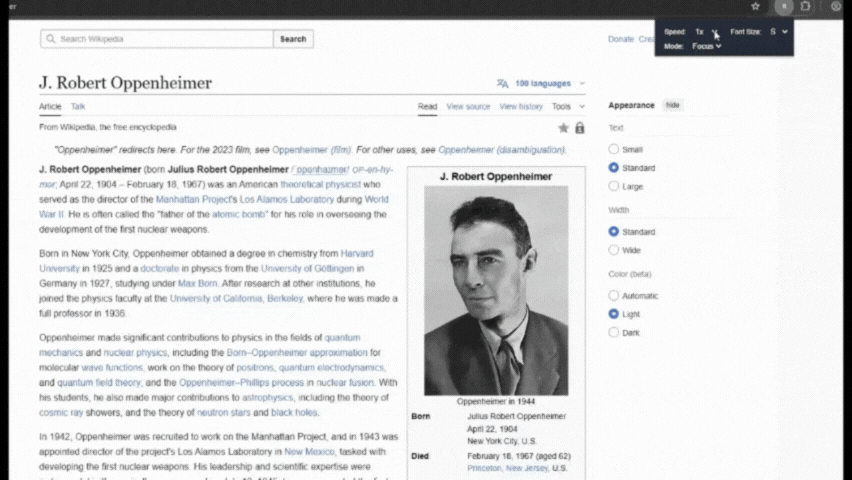

# RSVP Chrome Extension 🚀

A simple Chrome extension that demonstrates RSVP (Rapid Serial Visual Presentation) functionality for speed reading. This project includes a sample video to showcase the extension in action.

## Features ✨
- Quickly display text one word at a time for faster reading
- Easy-to-use popup interface
- Lightweight and fast

## How to Use 🛠️
1. **Clone or Download** this repository to your computer.
2. **Open Chrome** and go to `chrome://extensions/`.
3. Enable **Developer mode** (top right).
4. Click **Load unpacked** and select this project folder.
5. Click the extension icon to open the popup and start using RSVP!

## Demo GIF 🎬

Check out the animated demo above to see the extension in action!

If you want to see a longer demo, check out the video version above!

## Files 📁
- `manifest.json` – Extension configuration
- `background.js` – Background script
- `popup.html` – Popup UI
- `popup.js` – Popup logic
- `video/vid1.mp4` – Example RSVP demo video
- `video/vid1.gif` – Example RSVP demo as GIF

## License 📄
MIT

---
Enjoy speed reading with RSVP! 🚀
